# Pass1 Batch Processor - Sequence Diagram

This sequence diagram shows the complete data processing flow when analyzed transcription data is downloaded from Cloud Storage and processed by the `pass1_batch_processor` Cloud Function.

```mermaid
sequenceDiagram
    participant Client
    participant CloudFunction as pass1_batch_processor
    participant Config as ProcessingConfig
    participant Memory as Memory Monitor
    participant GCS as Google Cloud Storage
    participant BQ as BigQuery
    participant JSON as JSON Parser
    participant DataProcessor as Data Processing Functions

    Note over Client,DataProcessor: Initial Request Processing
    Client->>CloudFunction: HTTP POST with batch job results
    CloudFunction->>CloudFunction: start_time = time.time()
    CloudFunction->>CloudFunction: request.get_json()
    CloudFunction->>Config: new ProcessingConfig(request_json)
    
    Note over Config: Configuration Setup
    Config->>Config: Parse output_info from batch job
    Config->>Config: Extract bucket_name and prefix
    Config->>Config: Validate required parameters
    Config-->>CloudFunction: config object

    Note over CloudFunction: Initial Memory Check
    CloudFunction->>Memory: monitor_memory_usage()
    Memory-->>CloudFunction: (used_percent, available_mb)

    Note over CloudFunction,GCS: Step 1: Download from GCS
    CloudFunction->>GCS: download_batch_results_from_gcs(bucket, prefix)
    Note over GCS: With @with_retry decorator
    GCS->>GCS: List blobs with prefix
    GCS->>GCS: Find prediction*.jsonl files
    alt Multiple prediction files
        GCS->>GCS: Combine multiple files
    else Single prediction file
        GCS->>GCS: Download single file
    end
    GCS-->>CloudFunction: jsonl_content (string)

    Note over CloudFunction: Memory Check After Download
    CloudFunction->>Memory: check_memory_threshold()
    Memory-->>CloudFunction: memory_ok (boolean)
    
    alt High memory usage
        CloudFunction->>CloudFunction: config.enable_chunked_processing = True
    end

    Note over CloudFunction: Step 2: Data Processing Decision
    alt Large file (>1MB) and chunked processing enabled
        CloudFunction->>CloudFunction: process_large_file_chunked()
        Note over CloudFunction: Chunked Processing Loop
        loop For each chunk
            CloudFunction->>CloudFunction: Split lines into chunks
            CloudFunction->>CloudFunction: Check timeout
            CloudFunction->>DataProcessor: extract_batch_from_content(chunk)
            CloudFunction->>DataProcessor: parse_responses(extracted_data)
            CloudFunction->>CloudFunction: process_and_upload_data()
            CloudFunction->>Memory: check_memory_threshold()
            alt High memory usage
                CloudFunction->>CloudFunction: gc.collect()
            end
        end
    else Small file or chunked disabled
        CloudFunction->>CloudFunction: process_entire_file()
        CloudFunction->>DataProcessor: extract_batch_from_content(jsonl_content)
        CloudFunction->>DataProcessor: parse_responses(extracted_data)
        CloudFunction->>CloudFunction: process_and_upload_data()
    end

    Note over DataProcessor: Data Extraction Process
    DataProcessor->>DataProcessor: extract_batch_from_content()
    loop For each line in JSONL
        DataProcessor->>JSON: json.loads(raw_line)
        alt JSON parse succeeds
            DataProcessor->>DataProcessor: extract_via_json(obj)
            DataProcessor->>DataProcessor: safe_repair_json(text)
        else JSON parse fails
            DataProcessor->>DataProcessor: extract_via_regex(raw_line)
            DataProcessor->>DataProcessor: safe_repair_json(text)
        end
    end
    DataProcessor-->>CloudFunction: extracted_data {key: text}

    Note over DataProcessor: Response Parsing Process
    DataProcessor->>DataProcessor: parse_responses(extracted_data)
    loop For each key-value pair
        DataProcessor->>JSON: json.loads(response_str)
        DataProcessor->>DataProcessor: Validate payload is dict
    end
    DataProcessor-->>CloudFunction: parsed_responses {key: dict}

    Note over CloudFunction,BQ: Step 3: BigQuery Lookup and Upload
    CloudFunction->>CloudFunction: process_and_upload_data()
    CloudFunction->>CloudFunction: Check timeout
    
    Note over CloudFunction: Extract Phone Tokens
    CloudFunction->>CloudFunction: Extract phone_tokens from parsed_responses
    loop For each composite_key
        CloudFunction->>CloudFunction: decode_base64_key(composite_key)
        CloudFunction->>CloudFunction: Extract phone_token
    end

    Note over CloudFunction,BQ: Fetch Interaction Details
    CloudFunction->>BQ: fetch_interaction_details_from_bq_by_phone_tokens()
    Note over BQ: With @with_retry decorator
    BQ->>BQ: Execute BigQuery query with phone_tokens
    BQ->>BQ: SELECT * FROM lookup_table WHERE phone_number_token IN UNNEST(@phone_tokens)
    BQ-->>CloudFunction: bq_interaction_map {phone_token: [rows]}

    Note over CloudFunction: Build Output Rows
    CloudFunction->>DataProcessor: build_analyzed_transcript_rows()
    loop For each parsed_response
        DataProcessor->>CloudFunction: decode_base64_key(composite_key)
        DataProcessor->>CloudFunction: Find matching BQ row by phone_token/interaction_id
        DataProcessor->>DataProcessor: Build row with response fields + BQ fields
        DataProcessor->>DataProcessor: convert_value_for_bq() for BQ compatibility
    end
    DataProcessor-->>CloudFunction: rows [dict]

    Note over CloudFunction,BQ: Insert to BigQuery
    CloudFunction->>BQ: insert_rows_to_bq_with_retry()
    Note over BQ: Batch Insertion with Retry Logic
    loop For each batch of rows
        BQ->>BQ: client.insert_rows_json(table, batch)
        alt Insertion succeeds
            BQ->>BQ: successful_rows += batch_size
        else Insertion fails
            BQ->>BQ: Check if error is retryable
            alt Retryable error and attempts < max_retries
                BQ->>BQ: Wait with exponential backoff
                BQ->>BQ: Retry insertion
            else Non-retryable or max retries reached
                BQ->>BQ: Log failed batch
            end
        end
    end
    BQ-->>CloudFunction: success_count

    Note over CloudFunction: Final Response
    CloudFunction->>CloudFunction: Calculate elapsed_time
    CloudFunction->>CloudFunction: Log completion statistics
    CloudFunction-->>Client: {status: "success", processed_records, processing_time_seconds, workflow_id}

    Note over Client,DataProcessor: Error Handling (if any step fails)
    alt Any step throws exception
        CloudFunction->>CloudFunction: Catch exception
        CloudFunction->>CloudFunction: Calculate elapsed_time
        CloudFunction->>CloudFunction: Log error with stack trace
        CloudFunction-->>Client: {status: "error", message, processing_time_seconds}
    end
```

## Key Processing Steps Explained:

### 1. **Configuration Setup**
- Parses the batch job output info to determine GCS location
- Validates required parameters (project_id, dataset, lookup_table, etc.)
- Sets up processing configuration with defaults

### 2. **Memory Monitoring**
- Continuously monitors memory usage throughout processing
- Enables chunked processing if memory usage is high
- Forces garbage collection between chunks if needed

### 3. **GCS Download**
- Uses retry logic with exponential backoff
- Handles multiple prediction files by combining them
- Downloads JSONL content containing batch prediction results

### 4. **Data Extraction**
- Processes JSONL line by line
- Uses JSON parsing first, falls back to regex if needed
- Repairs malformed JSON using `json_repair` library
- Extracts key-value pairs from each line

### 5. **Response Parsing**
- Parses the extracted text as JSON responses
- Validates that each response is a dictionary
- Handles parsing errors gracefully

### 6. **BigQuery Lookup**
- Decodes base64 composite keys to extract phone tokens
- Queries lookup table to fetch interaction details
- Maps phone tokens to their corresponding interaction records

### 7. **Row Building**
- Combines parsed response data with BigQuery lookup data
- Matches interactions by phone token and interaction ID
- Converts data types for BigQuery compatibility
- Builds structured rows for the output table

### 8. **BigQuery Insertion**
- Inserts rows in configurable batch sizes
- Uses retry logic for transient errors
- Handles both retryable and non-retryable errors
- Provides detailed error reporting for failed batches

### 9. **Error Handling & Monitoring**
- Comprehensive timeout checking throughout
- Detailed logging at each step
- Graceful error handling with meaningful error messages
- Performance monitoring and statistics

This architecture ensures robust processing of large batch prediction results with proper error handling, memory management, and data integrity. 