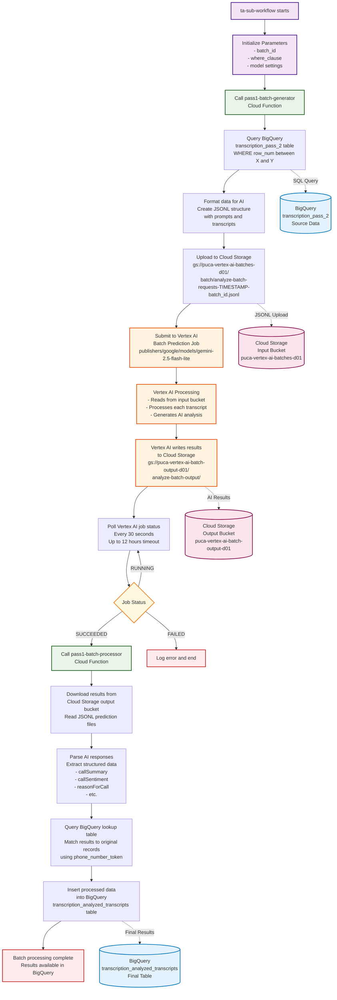

# Single Batch Lifecycle - GCP Services Flow

This diagram shows the detailed lifecycle of a single batch through all GCP services, focusing on data flow between Cloud Storage, Cloud Functions, Vertex AI, and BigQuery.



## Detailed GCP Service Interactions

### 🔄 **Workflow Orchestration**
- **ta-sub-workflow**: Google Cloud Workflows service that coordinates the entire batch lifecycle
- **Parameters**: Receives batch_id, row ranges, model settings, and bucket configurations

### ⚙️ **Cloud Functions**

#### **pass1-batch-generator Function**
1. **BigQuery Query**: 
   ```sql
   SELECT * FROM transcription_pass_2 
   WHERE row_num BETWEEN start_row AND end_row
   ```
2. **Data Formatting**: Converts transcript data into JSONL format with AI prompts
3. **Cloud Storage Upload**: Saves formatted data to input bucket with timestamped filename

#### **pass1-batch-processor Function**
1. **Cloud Storage Download**: Retrieves AI results from output bucket
2. **Data Parsing**: Extracts structured insights from AI responses
3. **BigQuery Lookup**: Matches results back to original records
4. **BigQuery Insert**: Saves final processed data to destination table

### 🤖 **Vertex AI Batch Prediction**
- **Input**: Reads JSONL files from `puca-vertex-ai-batches-d01` bucket
- **Model**: Uses `publishers/google/models/gemini-2.5-flash-lite`
- **Processing**: Analyzes each transcript for:
  - Call summary and sentiment
  - Reason for call and intent classification
  - Language detection and tone analysis
- **Output**: Writes results to `puca-vertex-ai-batch-output-d01` bucket

### 💾 **Cloud Storage Buckets**

#### **Input Bucket**: `puca-vertex-ai-batches-d01`
- **Purpose**: Stores formatted transcript data ready for AI processing
- **File Format**: JSONL (JSON Lines)
- **Naming**: `batch/analyze-batch-requests-{timestamp}-{batch_id}.jsonl`
- **Content**: Each line contains a transcript with AI analysis prompts

#### **Output Bucket**: `puca-vertex-ai-batch-output-d01`
- **Purpose**: Stores AI-generated analysis results
- **File Format**: JSONL with AI predictions
- **Naming**: `analyze-batch-output/{job_id}/predictions.jsonl`
- **Content**: Structured analysis results for each transcript

### 🗄️ **BigQuery Tables**

#### **Source Table**: `transcription_pass_2`
- **Purpose**: Contains original transcript data
- **Query**: Filtered by row ranges to get specific batches
- **Key Fields**: `phone_number_token`, `transcript`, `direction`, etc.

#### **Final Table**: `transcription_analyzed_transcripts`
- **Purpose**: Stores AI-analyzed results
- **Content**: Original data + AI insights (sentiment, intent, summary, etc.)
- **Key Fields**: All original fields plus AI-generated analysis fields

## Data Flow Summary

1. **Extract**: Query BigQuery for transcript data in specified row range
2. **Transform**: Format data with AI prompts into JSONL structure
3. **Load**: Upload formatted data to Cloud Storage input bucket
4. **Process**: Submit to Vertex AI for batch prediction analysis
5. **Retrieve**: Download AI results from Cloud Storage output bucket
6. **Enrich**: Match AI results back to original records via BigQuery lookup
7. **Store**: Insert enriched data into final BigQuery table

## Key Performance Considerations

- **Parallel Processing**: Multiple batches can run simultaneously
- **Batch Size**: Configurable (typically 10,000 records per batch)
- **Timeout Handling**: 12-hour maximum wait for AI processing
- **Error Handling**: Retry logic and graceful failure handling
- **Memory Management**: Chunked processing for large result files
- **Cost Optimization**: Efficient use of Vertex AI batch prediction pricing

## Monitoring Points

- **Cloud Storage**: Monitor upload/download operations and file sizes
- **Vertex AI**: Track job status, processing time, and success rates
- **BigQuery**: Monitor query performance and data insertion rates
- **Cloud Functions**: Check execution logs and error rates
- **Workflows**: Monitor overall orchestration and step completion
