# Complete Flow Diagram: Master Orchestrator to BigQuery Output

## 🎯 **Overview**

This diagram traces the complete flow from the master orchestrator through all components to the final BigQuery output, including error handling and recovery scenarios.

## 📊 **Complete Flow Diagram**

```mermaid
graph TD
    %% Start
    A[🎯 Master Orchestrator Workflow] --> B[📋 Initialize Parameters]
    B --> C[🔢 Get Total Records from BigQuery]
    C --> D[📝 Create Batch Plan]
    
    
    %% Initial Batch Launch
    D --> F[🚀 Start Initial Batches]
    F --> G[🔄 Launch ta-sub-workflow Sub-workflows]
    
    %% Individual Batch Workflow
    G --> H[📁 ta-sub-workflow Sub-workflow]
    H --> I[📤 Call pass1-batch-generator Function]
    
    %% Batch Generator
    I --> J{🔍 Query BigQuery with Deduplication}
    J --> K[📄 Generate JSONL Batch File]
    K --> L[☁️ Upload to GCS Bucket]
    
    %% Vertex AI Batch Prediction
    L --> M[🤖 Submit Vertex AI Batch Prediction Job]
    M --> N[⏳ Poll Job Status]
    N --> O{❓ Job Status?}
    
    %% Job Success Path
    O -->|✅ SUCCEEDED| P[📥 Download Results from GCS]
    O -->|❌ FAILED| Q[💥 Batch Job Failed]
    O -->|⏸️ CANCELLED| R[🚫 Batch Job Cancelled]
    O -->|⏳ RUNNING| N
    
    %% Batch Processor
    P --> S[📤 Call pass1-batch-processor Function]
    S --> T[🔍 Parse Vertex AI Responses]
    T --> U[📊 Insert Results to BigQuery]
    
    %% Success Tracking
    U --> V[✅ Update processed_records Table]
    V --> W[📝 Track Individual Errors]
    W --> X[📈 Report Completion to batch-orchestrator]
    
    
    %% Error Scenarios
    
    R --> AA[📊 Batch Status = 'failed']
    
    %% Individual Record Errors
    W --> BB{❓ Any Record Errors?}
    BB -->|✅ Yes| CC[📝 Insert to error_tracking Table]
    BB -->|❌ No| X
    CC --> X
    
    %% Monitoring Loop
    X --> DD[🔄 Monitor and Continue Loop]
    DD --> EE[🔍 Check Batch Statuses via batch-orchestrator]
    
    
    
    
    %% Completion
    X --> II{❓ All Batches Complete?}
    II -->|❌ No| DD
    II -->|✅ Yes| JJ[📊 Generate Summary Report]
    JJ --> KK[🎉 Master Orchestrator Complete]
    
    %% Recovery Scenarios
    AA --> LL[🔄 Recovery: Reprocess Failed Batch]
    LL --> H
    
    %% Styling
    classDef success fill:#d4edda,stroke:#155724,stroke-width:2px,color:#155724
    classDef error fill:#f8d7da,stroke:#721c24,stroke-width:2px,color:#721c24
    classDef process fill:#d1ecf1,stroke:#0c5460,stroke-width:2px,color:#0c5460
    classDef decision fill:#fff3cd,stroke:#856404,stroke-width:2px,color:#856404
    classDef storage fill:#e2e3e5,stroke:#383d41,stroke-width:2px,color:#383d41
    
    class A,B,C,D,F,G,H,I,J,K,L,M,N,P,S,T,U,V,W,X,JJ,KK process
    class O,BB,II decision
    class Q,R,AA,CC error
    class DD,EE,LL success
    class C,D,V,W,X,CC storage
```



## 🔄 **Detailed Component Flow**

### **1. Master Orchestrator Workflow**


### **2. Individual Batch Workflow**

```mermaid
graph LR
    A[📁 ta-sub-workflow] --> B[📤 Generate Batch]
    B --> C[🤖 Vertex AI Job]
    C --> D[📥 Process Results]
    D --> E[📊 Update Tracking]
    
    classDef process fill:#d1ecf1,stroke:#0c5460,stroke-width:2px,color:#0c5460
    class A,B,C,D,E process
```


### **3. Error Handling Flow**

```mermaid
graph TD
    A[❌ Error Occurs] --> B{❓ Error Type?}
    
    B -->|Record Level| D[📝 Insert to error_tracking]
    B -->|System Level| E[🚨 Log and Alert]
    
    C --> F[🔄 Mark Batch for Reprocessing]
    D --> G[🔍 Debug Systemic Issues]
    E --> H[⚡ Immediate Action Required]
    
    classDef error fill:#f8d7da,stroke:#721c24,stroke-width:2px,color:#721c24
    classDef process fill:#d1ecf1,stroke:#0c5460,stroke-width:2px,color:#0c5460
    classDef decision fill:#fff3cd,stroke:#856404,stroke-width:2px,color:#856404
    
    class A,C,D,E,F,G,H error
    class B decision
```


## 📊 **Data Flow Between Components**

### **BigQuery Tables Interaction**

```mermaid
graph TD
    A[📊 transcription_pass_2] --> B[📤 pass1-batch-generator]
    B --> C[📄 JSONL File]
    C --> D[🤖 Vertex AI]
    D --> E[📥 pass1-batch-processor]
    E --> F[📊 transcription_analyzed_transcripts]
    
    
    H --> G
    
    I[📊 processed_records] --> B
    E --> I
    
    J[📊 error_tracking] --> E
    
    classDef storage fill:#e2e3e5,stroke:#383d41,stroke-width:2px,color:#383d41
    classDef process fill:#d1ecf1,stroke:#0c5460,stroke-width:2px,color:#0c5460
    
    class A,F,G,I,J storage
    class B,C,D,E,H process
```


## 🚨 **Error Scenarios and Recovery**

### **Scenario 1: Batch Job Failure**

```mermaid
graph LR
    A[🤖 Vertex AI Job] --> B[❌ FAILED]
    B --> C[💾 Status: 'failed']
    C --> D[🔄 Recovery: Reprocess Batch]
    D --> A
    
    classDef error fill:#f8d7da,stroke:#721c24,stroke-width:2px,color:#721c24
    classDef process fill:#d1ecf1,stroke:#0c5460,stroke-width:2px,color:#0c5460
    
    class B,C error
    class A,D process
```


### **Scenario 2: Individual Record Errors**

```mermaid
graph LR
    A[📥 Parse Response] --> B[❌ JSON Parse Error]
    A --> C[❌ Missing Summary]
    A --> D[❌ Vertex AI Error]
    
    B --> E[📝 error_tracking: 'json_parse_error']
    C --> F[📝 error_tracking: 'missing_summary']
    D --> G[📝 error_tracking: 'vertex_ai_error']
    
    E --> H[🔍 Debug Systemic Issues]
    F --> H
    G --> H
    
    classDef error fill:#f8d7da,stroke:#721c24,stroke-width:2px,color:#721c24
    classDef process fill:#d1ecf1,stroke:#0c5460,stroke-width:2px,color:#0c5460
    
    class B,C,D,E,F,G error
    class A,H process
```


### **Scenario 3: Cloud Function Timeout**

```mermaid
graph LR
    A[📤 Cloud Function Call] --> B[⏰ Timeout]
    B --> C[🔄 Retry Logic]
    C --> D{❓ Max Retries?}
    D -->|❌ No| A
    D -->|✅ Yes| E[💾 Mark as Failed]
    E --> F[🔄 Manual Recovery Required]
    
    classDef error fill:#f8d7da,stroke:#721c24,stroke-width:2px,color:#721c24
    classDef process fill:#d1ecf1,stroke:#0c5460,stroke-width:2px,color:#0c5460
    classDef decision fill:#fff3cd,stroke:#856404,stroke-width:2px,color:#856404
    
    class B,E,F error
    class A,C process
    class D decision
```


## 📈 **Monitoring and Progress Tracking**

### **Real-time Monitoring Queries**
```sql


-- Error Analysis
SELECT 
    error_type,
    COUNT(*) as error_count
FROM error_tracking
WHERE created_at >= TIMESTAMP_SUB(CURRENT_TIMESTAMP(), INTERVAL 1 HOUR)
GROUP BY error_type
ORDER BY error_count DESC;


```

## 🎯 **Key Success Metrics**

- ✅ **Batch Success Rate**: Percentage of batches completed successfully
- ✅ **Processing Rate**: Batches processed per hour
- ✅ **Error Rate**: Percentage of records with processing errors
- ✅ **Deduplication Rate**: Percentage of records skipped due to prior processing
- ✅ **Recovery Time**: Time to identify and reprocess failed batches

## 🔧 **Recovery Commands**

```bash


# Reprocess failed batch
gcloud workflows execute ta-sub-workflow \
  --data='{"start_row": 1, "end_row": 10000, "execution_id": "recovery_123"}'

# Clear processing history for complete reprocessing
bq query --use_legacy_sql=false "
DELETE FROM processed_records 
WHERE first_processed_execution_id = 'old_execution_id'
"
```

This comprehensive flow diagram shows the complete journey from master orchestrator to final BigQuery output, including all error scenarios and recovery mechanisms!
