# High-Level Application Architecture - Transcription Analytics Workflow

This diagram shows the high-level architecture of the transcription analytics workflow system using GCP services.

```mermaid
graph TB
    %% External Trigger
    User[👤 User] -->|triggers| Script[📜 trigger_workflows.sh]
    
    %% Main Workflow Orchestration
    Script -->|HTTP POST| MainWF[🔄 ta-main-workflow<br/>Google Cloud Workflows]
    
    %% Batch Orchestration
    MainWF -->|HTTP POST| BatchOrch[⚙️ batch-orchestrator<br/>Cloud Function]
    BatchOrch -->|Query| BQSource[(🗄️ BigQuery<br>transcription_index<br/>Source Data)]
    BatchOrch -->|Batch Plan| MainWF
    
    %% Manager Workflow
    MainWF -->|HTTP POST| ManagerWF[🔄 ta-manager-workflow<br/>Google Cloud Workflows]
    
    %% Parallel Sub-Workflows
    ManagerWF -->|Parallel Execution| SubWF1[🔄 ta-sub-workflow<br/>Instance 1]
    ManagerWF -->|Parallel Execution| SubWF2[🔄 ta-sub-workflow<br/>Instance 2]
    ManagerWF -->|Parallel Execution| SubWF3[🔄 ta-sub-workflow<br/>Instance N]
    
    %% Batch Generator Function
    SubWF1 -->|HTTP POST| BatchGen[⚙️ pass1-batch-generator<br/>Cloud Function]
    SubWF2 -->|HTTP POST| BatchGen
    SubWF3 -->|HTTP POST| BatchGen
    
    %% Data Processing Flow
    BatchGen -->|Query| BQSource
    BatchGen -->|Upload JSONL| CSInput[(☁️ Cloud Storage<br/>Input Bucket<br/>puca-vertex-ai-batches-d01)]
    
    %% Vertex AI Processing
    SubWF1 -->|Submit Batch Job| VertexAI[🤖 Vertex AI<br/>Batch Prediction<br/>Gemini 2.5 Flash Lite]
    SubWF2 -->|Submit Batch Job| VertexAI
    SubWF3 -->|Submit Batch Job| VertexAI
    
    VertexAI -->|Read Input| CSInput
    VertexAI -->|Write Results| CSOutput[(☁️ Cloud Storage<br/>Output Bucket<br/>puca-vertex-ai-batch-output-d01)]
    
    %% Batch Processor Function
    SubWF1 -->|HTTP POST| BatchProc[⚙️ pass1-batch-processor<br/>Cloud Function]
    SubWF2 -->|HTTP POST| BatchProc
    SubWF3 -->|HTTP POST| BatchProc
    
    %% Final Data Storage
    BatchProc -->|Download Results| CSOutput
    BatchProc -->|Query Lookup| BQSource
    BatchProc -->|Insert Results| BQFinal[(🗄️ BigQuery<br/>transcription_analyzed_transcripts<br/>Final Results)]
    
    %% Styling
    classDef workflow fill:#e3f2fd,stroke:#1976d2,stroke-width:3px,color:#000
    classDef function fill:#e8f5e8,stroke:#388e3c,stroke-width:3px,color:#000
    classDef ai fill:#fff3e0,stroke:#f57c00,stroke-width:3px,color:#000
    classDef storage fill:#fce4ec,stroke:#c2185b,stroke-width:3px,color:#000
    classDef bigquery fill:#f3e5f5,stroke:#7b1fa2,stroke-width:3px,color:#000
    classDef user fill:#ffebee,stroke:#d32f2f,stroke-width:3px,color:#000
    classDef script fill:#e0f2f1,stroke:#00695c,stroke-width:3px,color:#000
    
    class MainWF,ManagerWF,SubWF1,SubWF2,SubWF3 workflow
    class BatchOrch,BatchGen,BatchProc function
    class VertexAI ai
    class CSInput,CSOutput storage
    class BQSource,BQFinal bigquery
    class User user
    class Script script
```

## Architecture Components

### 🔄 **Google Cloud Workflows**
- **ta-main-workflow**: Main orchestrator that initiates the entire process
- **ta-manager-workflow**: Manages parallel execution of multiple batches
- **ta-sub-workflow**: Individual batch processor (multiple instances run in parallel)

### ⚙️ **Cloud Functions**
- **batch-orchestrator**: Creates batch plans and determines work distribution
- **pass1-batch-generator**: Queries BigQuery and formats data for AI processing
- **pass1-batch-processor**: Processes AI results and stores them in BigQuery

### 🤖 **Vertex AI**
- **Batch Prediction Service**: Uses Gemini 2.5 Flash Lite model for transcript analysis
- Processes JSONL input files containing transcript data
- Generates structured analysis results (sentiment, intent, summary, etc.)

### ☁️ **Cloud Storage**
- **Input Bucket** (`puca-vertex-ai-batches-d01`): Stores formatted transcript data
- **Output Bucket** (`puca-vertex-ai-batch-output-d01`): Stores AI analysis results

### 🗄️ **BigQuery**
- **Source Table** (`transcription_index`): Contains original transcript data
- **Final Table** (`transcription_analyzed_transcripts`): Stores AI-analyzed results

## Data Flow Summary

1. **Trigger**: User runs `trigger_workflows.sh` script
2. **Orchestration**: Main workflow coordinates the entire process
3. **Planning**: Batch orchestrator creates work distribution plan
4. **Parallel Processing**: Manager workflow starts multiple sub-workflows
5. **Data Preparation**: Each sub-workflow calls batch generator to format data
6. **AI Processing**: Vertex AI analyzes transcripts using Gemini model
7. **Result Processing**: Batch processor saves results back to BigQuery
8. **Completion**: All analyzed data is available in the final BigQuery table

## Key Features

- **Scalable**: Supports parallel processing of multiple batches
- **Resilient**: Built-in error handling and retry mechanisms
- **Cost-Effective**: Uses batch prediction for efficient AI processing
- **Monitorable**: Comprehensive logging and status tracking
- **Configurable**: Adjustable batch sizes and concurrency levels

## Performance Characteristics

- **Batch Size**: Typically 10,000 records per batch
- **Concurrency**: Configurable (default 5 parallel batches)
- **Processing Time**: 30 minutes to several hours depending on data size
- **Timeout**: 12-hour maximum wait for AI processing
- **Throughput**: Can process hundreds of thousands of records per day
