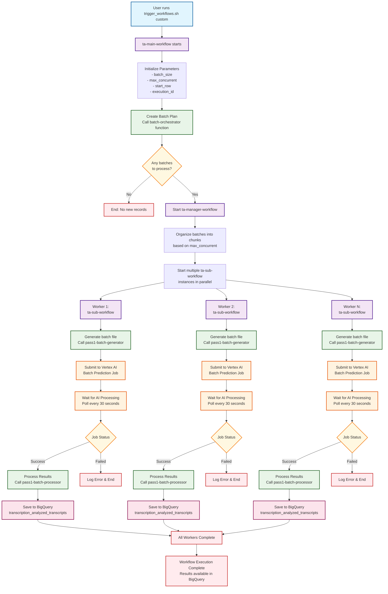

# Transcription Analytics Workflow Flow Diagram

This Mermaid diagram shows the high-level flow through all workflows when you run `trigger_workflows.sh custom`.

## Key Components Explained

### 🎯 **User Action** (Blue)
- **trigger_workflows.sh custom**: The entry point where you specify batch size, concurrency, and start row

### 🔄 **Workflows** (Purple)
- **ta-main-workflow**: Master coordinator that sets up parameters and starts the manager
- **ta-manager-workflow**: Organizes batches and starts multiple workers in parallel
- **ta-sub-workflow**: Individual worker that processes one batch of data

### ⚙️ **Cloud Functions** (Green)
- **batch-orchestrator**: Creates the batch plan with row ranges
- **pass1-batch-generator**: Prepares data files for AI processing
- **pass1-batch-processor**: Saves AI results back to database

### 🤖 **AI Processing** (Orange)
- **Vertex AI Batch Prediction**: Google's AI service that analyzes transcripts using Gemini model
- **Polling**: Waits for AI to complete (can take 30 minutes to several hours)

### 💾 **Storage** (Pink)
- **BigQuery**: Final destination where all analyzed results are stored

### ❓ **Decision Points** (Yellow)
- **Any batches to process?**: Checks if there's work to do
- **Job Status**: Monitors AI processing success/failure

### 🏁 **End States** (Red)
- **No new records**: When there's nothing to process
- **Errors**: When something goes wrong
- **Complete**: When all processing is finished

## Parallel Processing Flow

The diagram shows how multiple workers (J1, J2, J3, etc.) run simultaneously, each processing different batches of data. This parallel approach significantly speeds up the overall processing time.

## Custom Run Specifics

When you use `trigger_workflows.sh custom [batch_size] [concurrent] [start_row]`:
- You control exactly how many records per batch
- You control how many batches run at the same time
- You can start from any row number (useful for resuming interrupted processing)

The flow remains the same, but your parameters determine:
- How many workers are created
- How much data each worker processes
- Where processing begins
